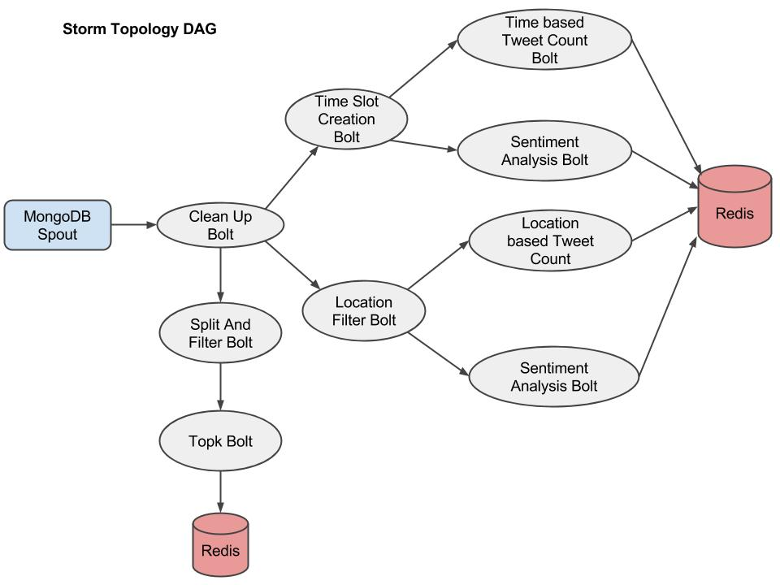

# GeoSpatial and Time series Analysis of Twitter data

#### Development Enviornment
OS: Ubuntu 14.04 Base Image from VCL.

####Project Setup:

- Because of the large number of dependencies, the easiest way to setup this project is to load a fresh `Ubuntu 14.04 Base` image from on VCL (Ncsu virtual computing Lab) and use setup script provided in the project folder. Note: The setup script is tested with clean Ubuntu enviornment without any packages pre installed. Running the script in your local machine may produce some unexpected results.
- Once the vcl instance is ready, download the tweet_analysis/ folder inside $HOME.
- Run `sudo sh setup.sh` inside project folder. This will install all the required programs for running the project. 
- Now we need to start storm topology and submit the job. Run `sparse run -t 200` inside project folder. This will automatically start storm instance and submit the topology to storm. `-t` option is used for specifying the run time for topology. So the above command will ensure that topology runs for 200 seconds. 
- Now start the live dashboard by running 
  
   ```
   1. cd dashboard/
   2. sudo npm install
   3. node app.js 
   ``` 
   
- The live dashboard can be seen at `http://<VCL instance ip>:3000`

####List of project dependencies

- JDK 7+
- [Streamparse](https://github.com/Parsely/streamparse): Project Managment package for Apache storm. It enables to write spouts and bolts in Python. It provides single command setup of storm project. 
    -Spouts are located inside src/spouts/ folder. 
    -Bolts are located inside src/bolts/ folder. 
    -Some Extra helper files are located inside src/helper/ folder.
    -Topologies are defined in form of DAG by clojure file topoogies/tweetAnalysis.clg

- [Lein](http://leiningen.org/): Used by streamparse package for commnicating with storm.

- [Redis](http://redis.io/topics/quickstart): We have used Redis for storing the results generated by storm Topology. Storm writes the aggregated results to Redis. NodeJs reads the result by polling Redis and displays the real time dashboard.

- [MongoDb](http://docs.mongodb.org): We collected 600K tweets during semi final match of cricket world cup 2015. We have stored these tweets in MongoDb. The spout used by topology reads tweets from MongoDB.

- [NodeJs](https://nodejs.org/): For implementing real time dashboard. NodeJs polls redis data base for any updates and displays result in Real Time.

####Storm Topology details:



- **MongoDB Spout:** Reads data from MongoDb and emits the data in form of stream.
- **Clean Up Bolt:** Performs basic text cleanup operations on tweet text.
- **Split And Filter Bolt:** Split the tweet text into words and remove the stop words.
- **TopK Bolt:** Maintain a CountMin Sketch in order to calculate Top-k words.
- **Time Slot Creation Bolt:** Performs Binning on timestamp in order to perform time series analysis.
- **Location Filter Bolt:** Filter the tweets based on country code. In a large proportion of data, country was not available. We try to extract the location using time zone in such cases.
- **Time based Tweet Count Bolt:** Count number of tweets received in particular time slot bin.
- **Location Based tweet Count:** Count number of tweets received in particular country.


####Individual Installation instructions(In case you want to manually install all the dependencies)

- JDK 7+, which you can install with apt-get, homebrew, or an installler; and
- lein, which you can install from the [project’s page](http://leiningen.org/)
   ```
   a) wget https://raw.githubusercontent.com/technomancy/leiningen/stable/bin/lein
   b) sudo mv lein /bin/
   c) chmod a+x /bin/lein
   d) lein -version
   ```
   It should print `Leiningen 2.5.1 on Java 1.7.0_65 OpenJDK 64-Bit Server VM` once successfully installed.

- Python 2.7 along with compatible pip installer. If incompatible run following command to upgrade pip.  
  ```
    sudo apt-get install python-pip
  ```
- Install Python-dev and Virtual Env
   ```
   sudo pip install -y python-dev virtualenv
   ```
- Install Redis server according according to instruction [here](http://redis.io/topics/quickstart)

- Install MongoDB according to instruction [here](http://docs.mongodb.org/manual/tutorial/install-mongodb-on-ubuntu/)

- Clone the project `git clone git@github.com:nirmeshKhandelwal/tweet_analysis.git`

- Install dependencies of Python
  ```
  $ cd tweet_analysis_v1`
  $ sudo pip install -r requirements.txt
  $python2 -m textblob.download_corpora 
  ```

- Make sure your mongoDB server and Redis server is up and running.

- Run `$ sparse run` in order to run the topology on local.


#### Data Format for Redis storage

##### Time Series
- Using [hash](http://redis.io/commands/hincrby) data structure of redis. 
- Hash key will be of format `time_slot:12` , `time_slot:27` ; where 12 and 27 and bin numbers.
- A hash has multiple "fields" which we will use to store summary for particular bin.
  - `tweet_count`: count of tweets received in this particular slot
  - `sentiment_pos` : positive sentiment count in this bin 
  - `sentiment_neg` : negative sentiment count in this bin 

References:

[1] [Stream Parse](https://github.com/Parsely/streamparse) for easy integration on Python with Storm.

[2] [Virtual Env] (https://virtualenv.pypa.io/en/latest/) tool to create isolate environment for python project.
